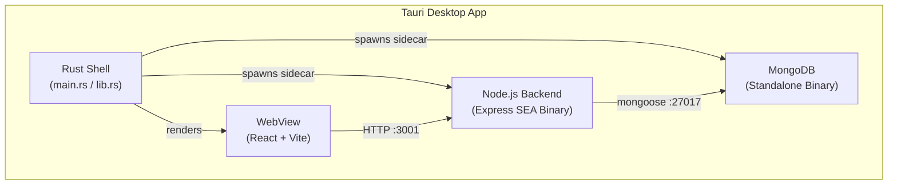
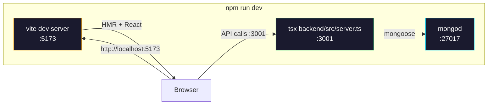
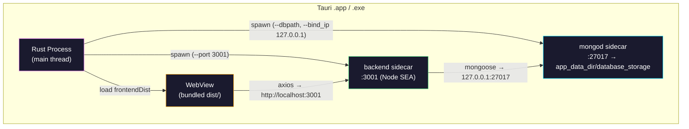
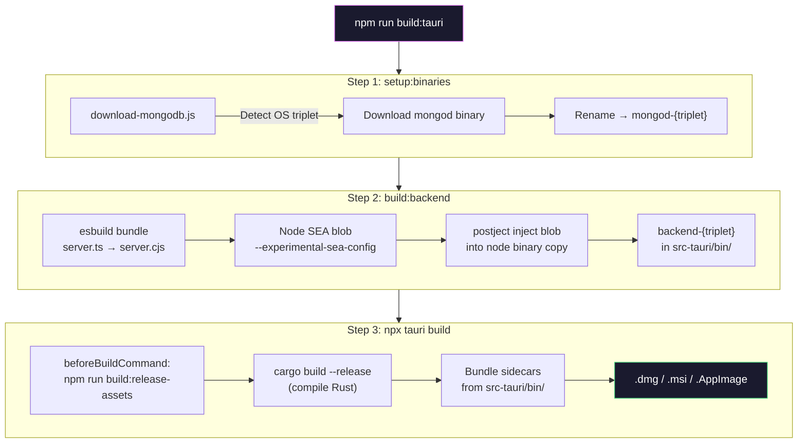
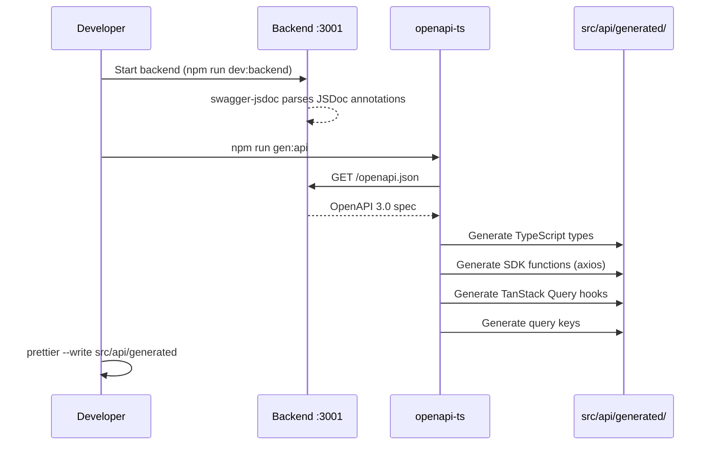
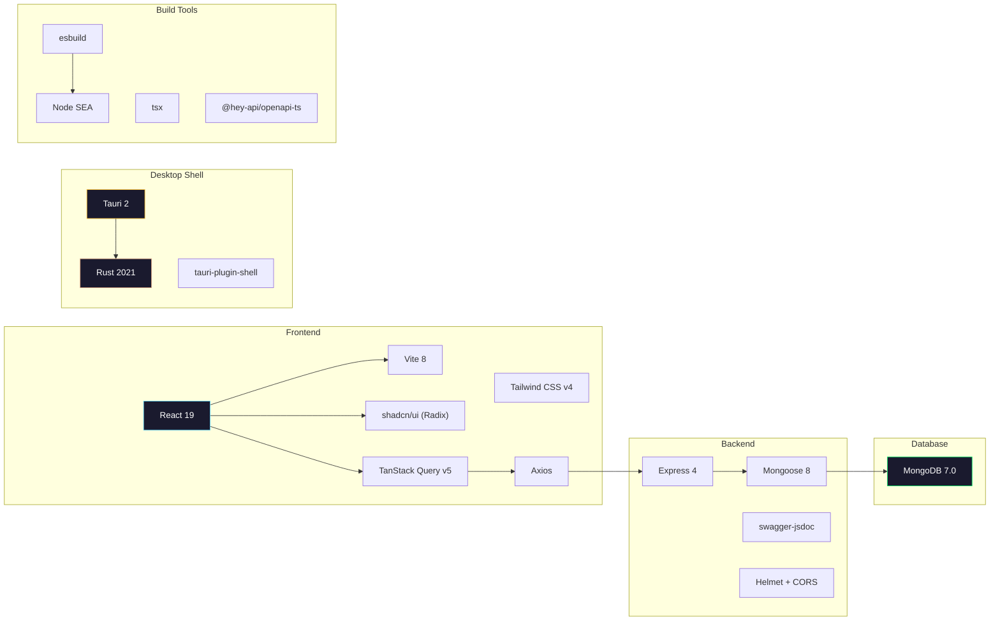
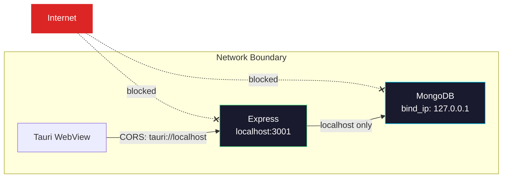
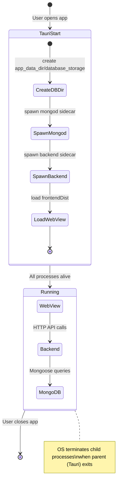

# Architecture — Vite + Tauri + Node + Rust Template

A full-stack desktop application template that bundles a **React frontend**, **Node.js/Express backend**, and **MongoDB** into a single native installer using **Tauri** (Rust).

---

## High-Level Architecture



---

## Project Structure

```
vite-tauri-node-rust-templete/
│
├── src/                        # React Frontend (Vite + TypeScript)
│   ├── api/
│   │   ├── generated/          # Auto-generated by openapi-ts
│   │   │   ├── @tanstack/      # TanStack Query hooks (queryOptions, mutations)
│   │   │   ├── client/         # Axios client implementation
│   │   │   ├── core/           # Serializers, auth, SSE utilities
│   │   │   ├── sdk.gen.ts      # Type-safe SDK functions
│   │   │   ├── types.gen.ts    # TypeScript types from OpenAPI spec
│   │   │   └── index.ts        # Barrel export
│   │   └── heyApiRuntime.ts    # Axios instance + base URL resolution
│   ├── components/
│   │   ├── ui/                 # shadcn/ui components (50+ components)
│   │   ├── stack-status.tsx    # Backend/MongoDB status dashboard
│   │   └── example.tsx         # Layout primitives
│   ├── main.tsx                # Entry point + QueryClientProvider
│   └── App.tsx                 # Root component
│
├── backend/                    # Node.js Backend (Express + Mongoose)
│   ├── src/
│   │   ├── config/
│   │   │   └── database.ts     # MongoDB connection manager
│   │   ├── middleware/
│   │   │   ├── errorHandler.ts # Global error handler
│   │   │   └── notFoundHandler.ts
│   │   ├── models/
│   │   │   └── User.ts         # Mongoose User model
│   │   ├── routes/
│   │   │   └── userRoutes.ts   # CRUD routes + Swagger JSDoc annotations
│   │   ├── services/
│   │   │   └── userService.ts  # Business logic layer
│   │   └── server.ts           # Express app + Swagger + OpenAPI JSON endpoint
│   └── tsconfig.json           # Backend-specific TS config (NodeNext)
│
├── src-tauri/                  # Tauri / Rust Shell
│   ├── src/
│   │   ├── main.rs             # Windows subsystem entry
│   │   └── lib.rs              # Sidecar lifecycle management
│   ├── bin/                    # Sidecar binaries (mongod + backend)
│   ├── capabilities/
│   │   └── default.json        # Permissions (shell:allow-spawn)
│   ├── Cargo.toml              # Rust dependencies
│   └── tauri.conf.json         # Tauri configuration + externalBin
│
├── scripts/                    # Build automation
│   ├── build-backend.js        # esbuild bundle → Node SEA executable
│   ├── download-mongodb.js     # Download + rename mongod per platform
│   └── rename-binaries.js      # Binary → Tauri triplet renaming
│
├── openapi-ts.config.ts        # API client code generation config
├── vite.config.ts              # Vite + Tailwind CSS v4 config
├── package.json                # Scripts + dependencies
└── tsconfig.json               # Root TypeScript config
```

---

## Runtime Architecture

### Development Mode



**Commands:**
| Command | Purpose |
|---|---|
| `npm run dev` | Browser-only (Vite + Backend + MongoDB) |
| `npm run dev:tauri` | Native Tauri window (Backend + MongoDB + `tauri dev`) |

In dev mode, Rust's `lib.rs` skips sidecar spawning (`#[cfg(debug_assertions)]`) and relies on the externally running processes.

### Production Mode (Built App)



When the Tauri app starts in release mode:
1. Rust creates `app_data_dir/database_storage` for MongoDB persistence
2. Spawns `mongod` sidecar bound to `127.0.0.1:27017` with journaling
3. Spawns `backend` sidecar (Node SEA executable) on port `3001`
4. Opens the WebView loading the bundled frontend from `dist/`
5. All child processes are tied to the Tauri process — they terminate when the app closes

---

## Build Pipeline



### Binary Naming Convention (Tauri Target Triplets)

| Platform | Backend Binary | MongoDB Binary |
|---|---|---|
| macOS ARM | `backend-aarch64-apple-darwin` | `mongod-aarch64-apple-darwin` |
| macOS Intel | `backend-x86_64-apple-darwin` | `mongod-x86_64-apple-darwin` |
| Windows x64 | `backend-x86_64-pc-windows-msvc.exe` | `mongod-x86_64-pc-windows-msvc.exe` |
| Linux x64 | `backend-x86_64-unknown-linux-gnu` | `mongod-x86_64-unknown-linux-gnu` |

---

## API Client Code Generation



### Generated Output

| File | Contents |
|---|---|
| `types.gen.ts` | TypeScript interfaces for all request/response shapes |
| `sdk.gen.ts` | Type-safe functions: `getApiUsers()`, `postApiUsers()`, etc. |
| `@tanstack/react-query.gen.ts` | `getApiUsersOptions()`, `postApiUsersMutation()`, query keys |
| `client.gen.ts` | Configured Axios client using `heyApiRuntime.ts` |

### Usage Example

```tsx
import { useQuery, useMutation } from "@tanstack/react-query"
import {
  getApiUsersOptions,
  postApiUsersMutation,
} from "@/api/generated/@tanstack/react-query.gen"

// Query — auto-typed, auto-keyed
const { data, isLoading } = useQuery(getApiUsersOptions())

// Mutation — auto-typed
const createUser = useMutation(postApiUsersMutation())
createUser.mutate({ body: { name: "Alice", email: "alice@example.com", password: "..." } })
```

---

## Technology Stack



| Layer | Technology | Version |
|---|---|---|
| **Frontend** | React + TypeScript | 19 |
| **Bundler** | Vite | 8 (beta) |
| **Styling** | Tailwind CSS + shadcn/ui | v4 |
| **State** | TanStack Query | v5 |
| **HTTP Client** | Axios | 1.x |
| **Backend** | Express | 4.x |
| **ORM** | Mongoose | 8.x |
| **Database** | MongoDB (embedded) | 7.0 |
| **Desktop** | Tauri | 2.x |
| **Shell** | Rust | 2021 edition |
| **API Codegen** | @hey-api/openapi-ts | 0.90 |
| **Backend Build** | esbuild + Node SEA | Node 20+ |

---

## Security Model



| Measure | Implementation |
|---|---|
| **MongoDB isolation** | `--bind_ip 127.0.0.1` — LAN devices cannot access the DB |
| **Data integrity** | `--journal` flag enables write-ahead logging to survive crashes |
| **Data persistence** | `app_data_dir/database_storage` — OS-managed writable path |
| **CORS** | Whitelist: `tauri://localhost`, `https://tauri.localhost`, `localhost:5173` |
| **HTTP security** | Helmet middleware (CSP, HSTS, XSS protection) |
| **Rate limiting** | 100 requests per 15 minutes per IP |
| **Request size** | 10 MB limit on JSON/URL-encoded bodies |
| **Tauri permissions** | Minimal: `core:default`, `shell:allow-spawn`, `shell:allow-open` |

---

## Process Lifecycle



---

## NPM Scripts Reference

| Script | Description |
|---|---|
| `npm run dev` | Start all services for browser development (Vite + Backend + MongoDB) |
| `npm run dev:tauri` | Start all services inside a native Tauri window |
| `npm run dev:frontend` | Vite dev server only (:5173) |
| `npm run dev:backend` | Express with hot-reload via nodemon + tsx |
| `npm run dev:db` | Local MongoDB instance |
| `npm run gen:api` | Generate API client + TanStack Query hooks from OpenAPI spec |
| `npm run build` | TypeScript check + Vite production build |
| `npm run build:tauri` | **Full production build** → `.dmg` / `.msi` / `.AppImage` |
| `npm run build:backend` | Bundle backend into Node SEA standalone executable |
| `npm run setup:binaries` | Download MongoDB binary for current platform |
| `npm run lint` | ESLint |

---

## Key Design Decisions

### Why Tauri over Electron?

- **Bundle size**: Tauri uses the OS WebView (~0 MB) vs Electron ships Chromium (~150 MB)
- **Memory**: Rust process manager uses ~5 MB vs Electron's ~80 MB overhead
- **Security**: Rust's memory safety + minimal permissions model

### Why Node SEA over pkg?

- `pkg` is deprecated and unmaintained
- Node SEA is the official Node.js solution (Node 20+)
- Uses `esbuild` for fast bundling + `postject` for binary injection

### Why Embedded MongoDB?

- Zero setup for end users — no external database installation
- Data stored in OS-managed `app_data_dir` — survives app updates
- Journal mode prevents corruption from unexpected shutdowns

### Why openapi-ts + TanStack Query Code Generation?

- Single source of truth: Swagger JSDoc annotations in route files
- Auto-generated TypeScript types, SDK functions, and query hooks
- Eliminates manual API client maintenance — run `npm run gen:api` after any route change
